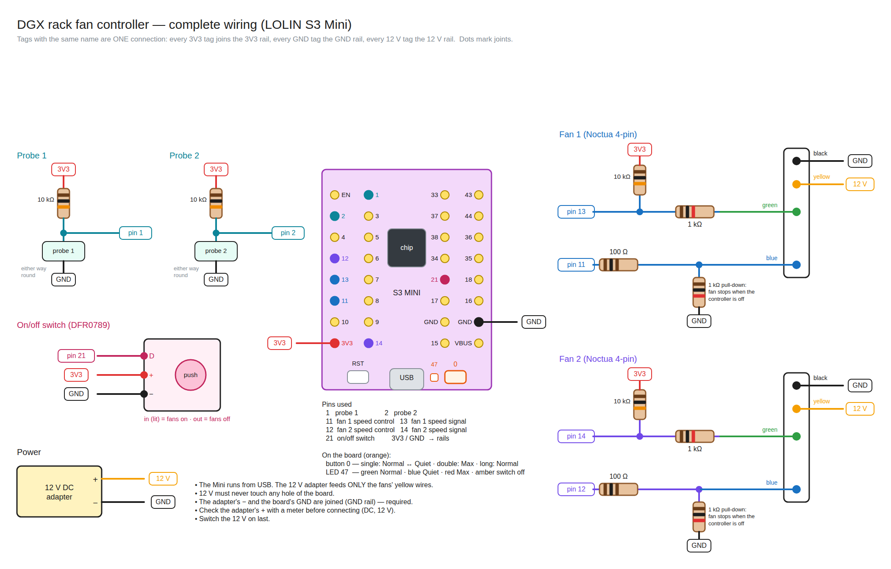

# ASUS Ascent GX10 Rack Cooling Controller

Firmware and tools for a small fan controller that helps cool two
**ASUS Ascent GX10**s in a rack. A LOLIN S3 Mini (ESP32-S3) reads two 10 kΩ
NTC probes and drives two Noctua 120 mm 4-pin PWM fans that blow up into the
GX10s' bottom intakes. Each fan follows its own probe.

```
 room air ─► Noctua fan ─► GX10 bottom intake ─► GX10 ─► warm air out the back
                                                        │
                                          probe (back of the shroud)
                                                        │
                                   controller reads it, sets that fan's speed
```

- Temperature curve: off below 30 °C, 20 % at 30 °C → 100 % at 55 °C
- Profiles Normal / Quiet / Max on the board's button, an on/off switch, RGB status LED
- Wi-Fi web page and JSON API, firmware updates over Wi-Fi
- Optional **GX-RACK** Docker service: dashboard with history, REST, and an
  MCP server so AI agents can read and control the fans

## Wiring

All wiring for the LOLIN S3 Mini in one schematic:



| Drawing | Shows |
|---------|-------|
| [Probes](docs/wiring/mini-probe-wiring.png) | both thermistor probes and their dividers, laid out on the board |
| [Fans](docs/wiring/mini-fan-wiring.png) | both fans, with pull-ups, pull-downs and 12 V |
| [Switch, button, LED](docs/wiring/mini-switch-wiring.png) | on/off switch, `0` button and status LED |
| [Full-size LOLIN S3](docs/wiring/full-size-s3/) | [probe](docs/wiring/full-size-s3/probe-wiring.png), [fans](docs/wiring/full-size-s3/fan-wiring.png) and [switch](docs/wiring/full-size-s3/switch-wiring.png) for the full-size board (add the 1 kΩ fan pull-downs) |

Pin-by-pin details and resistor values: [`controller/README.md`](controller/README.md)
and [`docs/components.md`](docs/components.md). The `.excalidraw` files are
editable; see [`docs/README.md`](docs/README.md) to regenerate the pictures.

## Repository layout

| Path | What |
|------|------|
| [`controller/`](controller/) | PlatformIO firmware project; [`README`](controller/README.md) has wiring, pins, console, calibration |
| [`docs/`](docs/) | [how it works](docs/how-it-works.md), [components](docs/components.md), [wiring drawings](docs/wiring/) |
| [`gx-rack/`](gx-rack/) | optional dashboard + REST + MCP server (Docker) — [setup](gx-rack/README.md) |
| [`agent/`](agent/) | helper scripts and [`AGENT.md`](agent/AGENT.md), the guide for changing this project (for AI agents and people) |

## Quick start

1. Build the hardware: parts in [`docs/components.md`](docs/components.md),
   wiring in [`docs/wiring/mini-complete-wiring.png`](docs/wiring/mini-complete-wiring.png).
2. Install [PlatformIO](https://platformio.org/) and flash over USB:
   ```
   cd controller
   pio run -t upload
   pio device monitor        # 115200
   ```
   First flash of a new S3 Mini: hold `0`, tap `RST`, release `0`.
3. In the serial console, set Wi-Fi and the web password
   (`wifi ssid …`, `wifi pass …`, `webpass …`). The page is then at
   `http://dgx-fans.local/` (user `fans`).
4. For the helper scripts, copy `controller/.env.example` to
   `controller/.env` and fill it in. It is ignored by git.
5. Optionally run the [GX-RACK](gx-rack/README.md) dashboard on any Docker host.

## No warranty — use at your own risk

**This project is provided as is, with no warranty of any kind.** It was
vibe coded: written largely with an AI assistant and tested only on one
home setup. It may contain mistakes in the firmware, the wiring drawings or
the docs. You are responsible for checking it before you build it, and for
anything it does to your hardware.

You are free to use, change and share it however you like (see the
[license](LICENSE)). Fork it, rewrite it, adapt it to your own rack.

## Safety note

The firmware deliberately has **no full-speed failsafe**: a faulty probe
stops its fan rather than running it at 100 %. The GX10s protect themselves
with their own fans and thermal shutdown, so this fan setup is an aid, not
their only cooling. Read [`docs/how-it-works.md`](docs/how-it-works.md)
before relying on it, and change the behaviour if your setup needs it.

## License

[MIT](LICENSE) — free to use and modify, provided without warranty.
