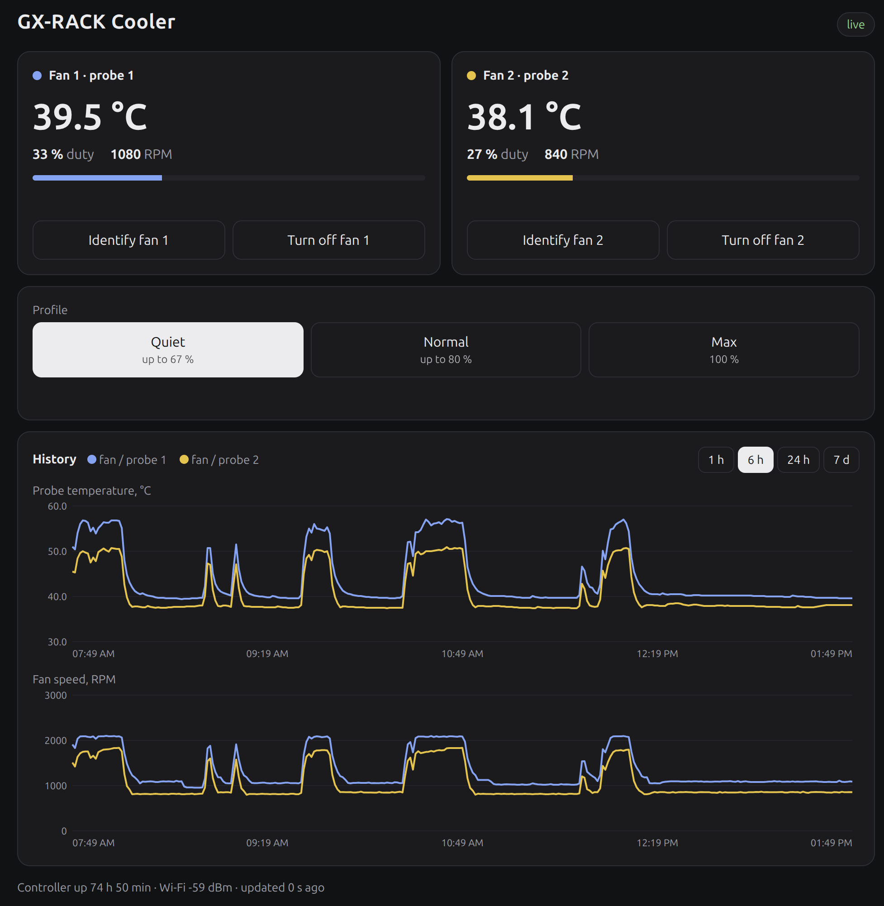

# GX-RACK

Dashboard, REST API and MCP server for the DGX rack fan controller. It runs
as a small Docker container on any machine on the same network as the
controller (home server, NAS, Raspberry Pi, VM…). It is optional: the
controller has its own simple page at `http://dgx-fans.local/`.



| For | Address (default) |
|-----|-------------------|
| Browser | `http://<host>:8096/` |
| Agents (MCP) | `http://<host>:8096/mcp` — header `X-API-Key` |
| Scripts (REST) | `http://<host>:8096/api/...` |

## What it does

- Asks the controller for its status every 2 s. The controller's own page
  stays as it is; GX-RACK just talks to it.
- Keeps 7 days of history (one sample every 10 s) in a SQLite file in the
  Docker volume `gx-rack_data`.
- **Dashboard:** both probe temperatures, duty and RPM, a history chart for
  temperature and RPM (1 h / 6 h / 24 h / 7 d, hover for values), and every
  control the controller's page has: Normal / Quiet / Max, Identify (with
  countdown and Stop), Turn off / Turn on per fan. It asks before turning off
  a fan whose probe is above 45 °C.
- **MCP server "GX-RACK"** with these tools:

| Tool | Does |
|------|------|
| `get_status` | temperatures, duty, RPM, turned-off / overheat per fan; profile, switch, identify, Wi-Fi, uptime |
| `get_history(minutes, max_points)` | averaged history, up to 7 days |
| `set_profile(profile)` | `normal` / `quiet` / `max` |
| `identify_fan(fan)` / `stop_identify()` | fan 100 %, other stopped, 15 s |
| `set_fan_power(fan, on)` | turn a fan off (hard stop, even when hot) or back on |
| `describe_system()` | the curve, profiles, which control wins, expected RPM |

## Who can do what

- **Looking** (page, `/api/status`, `/api/history`) is open to whoever can
  reach the port.
- **Controls in the browser** ask for the **fan controller's own login**
  (the same user and password as its page at `dgx-fans.local`).
- **`/mcp`** needs the API key in `X-API-Key` (or `Authorization: Bearer`).
  REST controls also accept it.

The controller login and the API key live only in `.env` next to
`compose.yaml` on the Docker host (mode 600). Template: `.env.example`.

## REST

```
GET  /api/status                  current state (same shape as get_status)
GET  /api/history?minutes=60&points=300
GET  /api/system                  what describe_system returns
POST /api/profile   name=normal|quiet|max
POST /api/identify  fan=1|2  (0 = stop)
POST /api/fan       fan=1|2  on=0|1
GET  /health
```

## Setup

1. Give the controller a **fixed DHCP lease** in your router. Docker has no
   mDNS, so the container reaches the controller by IP (`CONTROLLER_URL`).
2. Copy this folder to the Docker host and create `.env`:
   ```
   cp .env.example .env && chmod 600 .env
   openssl rand -hex 32          # paste as MCP_API_KEY
   ```
   `CONTROLLER_USER` / `CONTROLLER_PASS` are the controller's web login
   (`USER` / `WEBPASS` in `controller/.env`).
3. Start it and check:
   ```
   docker compose up -d --build
   curl http://127.0.0.1:8096/health
   ```

GX-RACK only ever connects *to* the controller, so router rules that stop
the controller from opening connections to other machines don't matter here.

## Exposing it on your network

By default the container listens on **loopback only** (`127.0.0.1:8096`).
Choose one:

- **Reverse proxy** (Caddy, nginx, Traefik…): point it at `127.0.0.1:8096`
  and add TLS like your other services. It must pass the `X-API-Key` header
  through (they all do by default).
- **Direct**: set `GX_RACK_BIND=0.0.0.0` in `.env` and run
  `docker compose up -d` again. That is plain HTTP on port 8096 — fine on a
  trusted home network; controls still need the password or the API key.

## Connecting an agent

Any MCP client that supports streamable HTTP with a custom header works. The
entry looks roughly like this (exact format depends on the client):

```yaml
mcp_servers:
  GX-RACK:
    url: http://<host>:8096/mcp
    headers:
      X-API-Key: <MCP_API_KEY from .env>
```

## Making it your own

The dashboard is a single static file, `app/static/index.html`, that only
uses the REST endpoints above. Restyle it or replace it; the server doesn't
care. What the controller does is described to agents by `SYSTEM` in
`app/main.py` — keep it in step when you change the firmware.

One fan or two needs no setting here: GX-RACK reads the count from the
controller (`fans` in its status) and shows one or two fans to match.

## Update

From your development machine, over ssh:

```
GX_RACK_HOST=user@server agent/deploy-gx-rack.sh   # copies gx-rack/ (never .env), rebuilds
```

Or on the Docker host itself: `docker compose up -d --build`.

## Run locally (testing)

```
docker build -t gx-rack:local .
docker run --rm --env-file some.env -p 127.0.0.1:18096:8000 gx-rack:local
```
